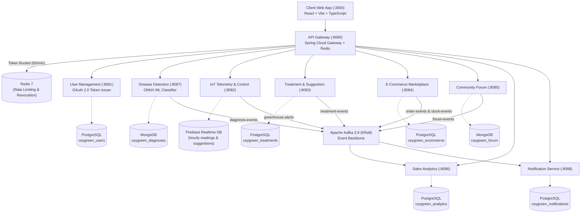

# CeyGreen — Microservices-Based Greenhouse Management System

CeyGreen is an end-to-end, distributed microservices platform that modernizes greenhouse farming by combining IoT sensing, machine-learning-assisted plant diagnostics, e-commerce marketplace, treatment recommendations, community forum, and sales analytics & notifications into a unified ecosystem.

All synchronous, user-facing traffic is securely routed through a central **Spring Cloud API Gateway** with Redis rate limiting and JWT verification, while an **Apache Kafka (KRaft)** event backbone enables asynchronous, resilient inter-service communication. The entire stack is containerized with **Docker Compose**, continuously integrated and deployed via **GitHub Actions**, and hosted live on **AWS EC2**.

---

## Live Deployment & Architecture Highlights

### Live AWS Deployment
- **Live Server**: **[http://16.192.168.12:3000](http://16.192.168.12:3000)** (Hosted on AWS EC2, Ubuntu 24.04 LTS).
- **Reverse Proxy**: Nginx container routing `/api/**` traffic directly to `api-gateway:8080` internally.
- **Automated CI/CD**: GitHub Actions workflow (`.github/workflows/cd.yml`) automatically builds pre-built container images and updates the live EC2 host on `main` branch merges.

### Pretrained ONNX ML Plant Disease Classification
- **Deep Learning Model**: ResNet50V2-based ONNX model (`backend/diagnosis-service/src/main/resources/models/disease_model.onnx`, ~94 MB) executed using Java ONNX Runtime.
- **25 Disease Classes**: Detects 25 pathology labels across Tomato, Potato, Pepper, Grape, Apple, and Corn crops.
- **Native Image Decoding**: Integrated TwelveMonkeys ImageIO (`imageio-webp:3.12.0`) supporting `.webp`, `.png`, `.jpg`, and `.jpeg` leaf image uploads.
- **Google Gemini 1.5 Flash AI**: Integrated for instant 14-day agronomic recovery plans and foliar spray schedules.

### Modern Mobile-First React Client (`frontend/`)
- **Interactive Crop Selector**: Dedicated detection views for 6 major greenhouse crop categories.
- **Agronomist Diagnostic Dashboard**: Visual confidence gauge, drag-and-drop image preview, and 4-tab clinical report (Key Symptoms, Environmental Drivers, Action Plan, Marketplace Products).
- **Comprehensive Teammate Modules**: Marketplace store, shopping cart, IoT greenhouse live telemetry, community discussion forum, treatment advisor, and sales analytics.

---

## System Architecture



---

## Team & Microservice Ownership

| Service Name | Port | Database / Storage | Tech Stack | Status |
|---|---|---|---|---|
| **API Gateway** | `8080` | Redis 7 | Spring Cloud Gateway, WebFlux | Live |
| **User Service** | `8081` | PostgreSQL (`ceygreen_users`) | Spring Boot 3, JPA, RSA JWT Issuer | Live |
| **Disease Detection Service** | `8087` | MongoDB (`ceygreen_diagnoses`) | Spring Boot 3, ONNX Runtime, TwelveMonkeys | Live |
| **IoT Telemetry & Control Service** | `8082` | Firebase Realtime DB | Spring Boot 3, Firebase Admin SDK, Kafka | Live |
| **Treatment & Suggestion Service** | `8083` | PostgreSQL (`ceygreen_treatments`) | Spring Boot 3, JPA, Kafka Producer | Live |
| **E-Commerce Marketplace Service** | `8084` | PostgreSQL (`ceygreen_ecommerce`) | Spring Boot 3, JPA, Kafka Producer | Live |
| **Community Forum Service** | `8085` | MongoDB (`ceygreen_forum`) | Spring Boot 3, Spring Data Mongo, Gemini AI | Live |
| **Sales Analytics Service** | `8086` | PostgreSQL (`ceygreen_analytics`) | Spring Boot 3, JPA, Kafka Consumer | Live |
| **Notification Service** | `8088` | PostgreSQL (`ceygreen_notifications`) | Spring Boot 3, JPA, Kafka Consumer | Live |
| **Frontend Web Application** | `3000` | Nginx SPA | React 18, Vite, TypeScript, TailwindCSS | Live |

---

## Service Independence Architecture

> **Hard Rule**: No internal service makes direct synchronous REST calls to another microservice. All cross-service coordination is either **client-orchestrated** or **event-driven via Apache Kafka**.

1. **Client-Orchestrated Coordination**: Disease Diagnosis outputs a predicted pathology; the frontend client independently queries the Treatment Service (`GET /treatments/{diseaseName}`) to retrieve matching cures.
2. **Stateless JWT Claims**: Services never query User Service to verify identities. The API Gateway validates tokens via RSA public key and passes identity headers (`X-Farmer-ID`, `X-User-Role`, `X-User-Email`) downstream.
3. **Database-Per-Service Isolation**: Each service owns its dedicated PostgreSQL database or MongoDB collection.
4. **Resilient Asynchronous Events**: Producers fire domain events to Kafka topics independently of consumer availability.

---

## Polyglot Persistence

| Storage Engine | Attached Services | Purpose |
|---|---|---|
| **PostgreSQL 16** | `user-service`, `treatment-service`, `ecommerce-service`, `analytics-service`, `notification-service` | ACID relational transactions for user accounts, marketplace orders, treatments, and analytic rollups. |
| **MongoDB 7.0** | `diagnosis-service`, `forum-service` | High-throughput document storage for plant diagnosis images, predictions, and nested forum discussions. |
| **Redis 7** | `api-gateway` | Token-bucket distributed rate limiting (60 req/min/IP) and token revocation storage. |
| **Firebase Realtime DB** | `iot-service` | Real-time greenhouse environmental telemetry and live sensor updates. |

---

## Kafka Event Backbone

| Topic | Producer | Consumer(s) | Trigger Condition |
|---|---|---|---|
| `greenhouse-alerts` | `iot-service` | `notification-service` | Temperature, humidity, or soil NPK sensor crosses danger threshold |
| `diagnosis-events` | `diagnosis-service` | `notification-service` | A plant disease leaf diagnosis is generated |
| `treatment-events` | `treatment-service` | `notification-service` | A high-severity disease remedy is prescribed |
| `order-events` | `ecommerce-service` | `analytics-service`, `notification-service` | A customer completes order checkout |
| `stock-events` | `ecommerce-service` | `notification-service` | Marketplace product inventory drops below restock threshold |
| `forum-events` | `forum-service` | `notification-service` | A community reply or agronomist comment is posted |

---

## Project Directory Structure

```text
CeyGreen/
├── backend/
│   ├── api-gateway/                      # Spring Cloud Gateway (port 8080)
│   ├── user-service/                     # User management & JWT Auth (port 8081)
│   ├── diagnosis-service/                # ONNX ML Disease Classifier (port 8087)
│   ├── iot-service/                      # IoT greenhouse control & Firebase (port 8082)
│   ├── treatment-service/                # Remedies & treatment engine (port 8083)
│   ├── ecommerce-service/                # Marketplace store & order manager (port 8084)
│   ├── forum-service/                    # Community discussions & AI helper (port 8085)
│   ├── analytics-service/                # Sales statistics & telemetry insights (port 8086)
│   └── notification-service/             # Multi-channel farmer alert manager (port 8088)
├── frontend/                             # React + Vite + TypeScript web application (port 3000)
├── db/postgres/                          # PostgreSQL database initialization scripts
├── .github/workflows/                    # GitHub Actions CI/CD workflows (cd.yml & ci.yml)
├── docker-compose.yml                    # Full-stack 25-component orchestration
├── .env.example                          # Environment variable configuration template
└── README.md                             # Project documentation
```

---

## Quick Start & Local Execution

### Prerequisites
- **Docker Desktop** (v24+ / Compose v2+)
- **Java 17+** & **Maven 3.9+** (optional, for local service compilation)
- **Node.js 20+** & **npm** (optional, for local client development)

### Running the Entire Stack Locally:

1. **Clone the repository**:
   ```bash
   git clone https://github.com/vikumkodikara/CeyGreen.git
   cd CeyGreen
   ```

2. **Configure environment**:
   ```bash
   cp .env.example .env
   ```

3. **Launch all 10 services & 4 datastores**:
   ```bash
   docker compose up -d --build
   ```

4. **Verify container health**:
   ```bash
   docker compose ps
   ```

### Service Endpoints

| Resource | Local Endpoint | Live AWS Endpoint |
|---|---|---|
| **Web Application** | `http://localhost:3000` | **`http://16.192.168.12:3000`** |
| **API Gateway Health** | `http://localhost:8080/actuator/health` | `http://16.192.168.12:8080/actuator/health` |
| **User Service Health** | `http://localhost:8081/actuator/health` | `http://16.192.168.12:8081/actuator/health` |
| **Diagnosis Service Health** | `http://localhost:8087/actuator/health` | `http://16.192.168.12:8087/actuator/health` |
| **IoT Service Health** | `http://localhost:8082/actuator/health` | `http://16.192.168.12:8082/actuator/health` |
| **Treatment Service Health** | `http://localhost:8083/actuator/health` | `http://16.192.168.12:8083/actuator/health` |
| **E-Commerce Service Health** | `http://localhost:8084/actuator/health` | `http://16.192.168.12:8084/actuator/health` |
| **Forum Service Health** | `http://localhost:8085/actuator/health` | `http://16.192.168.12:8085/actuator/health` |
| **Analytics Service Health** | `http://localhost:8086/actuator/health` | `http://16.192.168.12:8086/actuator/health` |
| **Notification Service Health** | `http://localhost:8088/actuator/health` | `http://16.192.168.12:8088/actuator/health` |

---

## Treatment & Suggestion Service (Port 8083)

- **Advanced Filtering**: `GET /treatments/search?crop=...&severity=...&type=ORGANIC` for eco-friendly solutions.
- **Crop Catalog**: `GET /treatments/crop/{cropName}` to browse treatments directly by crop type.
- **Community Feedback**: `POST /treatments/{id}/rate` allows farmers to submit 5-star ratings for treatments.
- **Alternative Remedies**: `GET /treatments/{id}/alternatives` fetches alternative options for the same disease.
- **Rich Data Schema**: Returns deep agricultural insights including Pre-Harvest Intervals (PHI), effectiveness scores, brand names, and application methods.
