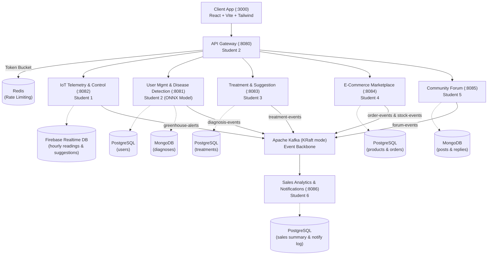

# CeyGreen — Microservices-Based Greenhouse Management System

CeyGreen is an end-to-end, distributed microservices platform that modernizes greenhouse farming by combining IoT sensing, machine-learning-assisted plant diagnostics, and community and marketplace features on a single platform. Each greenhouse is represented as a digital blueprint — a virtual layout of zones with ESP32-based IoT devices placed inside it that measure temperature, humidity, soil moisture, and soil NPK nutrient levels. Readings are captured hour by hour, streamed to Firebase for real-time updates, and turned into plain-language suggestions for the farmer.

All synchronous, user-facing traffic is routed through a central **API Gateway**, while an **Apache Kafka** event backbone connects the services that generate events to the service that consumes them. The full system is containerized with **Docker**, backed by automated **GitHub Actions CI/CD**, and deployed live to an **AWS EC2** instance.

---

## 🌟 Recent System Highlights & Major Updates

### 🤖 Pretrained ONNX ML Plant Disease Classification
- **Deep Learning Model**: Integrated a ResNet50V2-based ONNX model (`ml/disease-classifier/disease_model.onnx`, ~94 MB) running natively via Java ONNX Runtime (`onnxruntime 1.18.0`).
- **25 Disease Classes**: Covers 25 distinct plant pathology labels across 5 crop categories (`ml/disease-classifier/labels.txt`).
- **Native WebP & ImageIO Decoding**: Integrated TwelveMonkeys ImageIO (`imageio-webp:3.12.0`) to natively support `.webp`, `.png`, and `.jpeg` leaf uploads.
- **Pure ONNX Preprocessing**: Feeds raw 224×224 NHWC float pixel tensors directly into the neural network graph.

### 📱 Modern Mobile-Responsive React Client (`client/`)
- **6-Crop Product Selector**: Interactive dropdown supporting **Tomato**, **Potato**, **Pepper / Bell Pepper**, **Strawberry**, **Grape**, and **Other Greenhouse Crops**.
- **Confirm Password & Live Validation**: Real-time password matching badge (`✓ Passwords match` vs `✕ Passwords do not match`).
- **Touch-Friendly Eye Password Toggle**: Password field visibility toggle with 40×40 touch target size for mobile screens.
- **iOS Safari Optimization**: Enforces 16px base font size on input fields to prevent iOS Safari auto-zoom glitches.
- **Agronomist Diagnostic Dashboard**: Interactive drag-and-drop file preview, confidence gauge progress bar, and 4-tab agronomist report (Symptoms, Treatments, Prevention & IPM, Recommended Products).

### ✨ Live Google Gemini 1.5 Flash AI Integration
- Integrated Google's **Gemini 1.5 Flash API** (`client/src/api/gemini.ts`).
- Generates live, personalized 14-day greenhouse recovery action plans, humidity control guidelines, and foliar spray schedules based on predicted disease and crop type.
- Environment key configuration via `VITE_GEMINI_API_KEY` with seamless built-in fallback.

### ☁️ AWS Cloud Deployment & Automated CI/CD
- **Live AWS EC2 Server**: Deployed on Ubuntu 24.04 LTS EC2 (`eu-north-1` Stockholm) at **[http://16.192.168.12:3000](http://16.192.168.12:3000)**.
- **Nginx Reverse Proxy**: Custom Nginx configuration (`client/nginx.conf`) routing `/api/**` calls directly to `api-gateway:8080` within the Docker network.
- **GitHub Actions CD Pipeline**: Automated workflow (`.github/workflows/cd.yml`) that builds Docker images and deploys directly to EC2 on `main` branch updates.

---

## Architecture at a Glance



---

## Team & Service Ownership

| Student | Microservice | Port | Database | Status |
|---|---|---|---|---|
| 1 | [IoT Telemetry & Control Service](iot-service/) | 8082 | Firebase Realtime DB | Placeholder |
| 2 | [API Gateway](api-gateway/) + [User Mgmt & Disease Detection](user-diagnosis-service/) | 8080, 8081 | PostgreSQL + MongoDB | ✅ Complete |
| 3 | [Treatment & Suggestion Service](treatment-service/) | 8083 | PostgreSQL | Placeholder |
| 4 | [E-Commerce Marketplace Service](ecommerce-service/) | 8084 | PostgreSQL | Placeholder |
| 5 | [Community Forum Service](forum-service/) | 8085 | MongoDB | Placeholder |
| 6 | [Sales Analytics & Notification Service](analytics-notification-service/) | 8086 | PostgreSQL | Placeholder |
| Client | [React Web Application](client/) | 3000 | Nginx / Vite SPA | ✅ Complete |

---

## Service Independence — Hard Rule

> No internal service calls another service's REST API. All cross-service coordination is either **client-orchestrated** or **event-driven via Kafka**.

- **No REST call** ever goes from one internal microservice to another.
- **Diagnosis → Treatment is client-orchestrated**, not service-to-service. Disease Detection returns a predicted disease name to the client; the client then separately calls Treatment & Suggestion's `GET /treatments/{diseaseName}` itself.
- **Identity is a token claim, not a lookup.** Every service trusts the `farmerId`/`buyerId` embedded in the OAuth 2.0 access token that the Gateway validates and forwards. No service calls User Management to "ask" who a user is.
- **Each service owns its data exclusively** — database-per-service, with no exceptions.
- **Kafka consumption is not an availability dependency.** If Student 6's service is down, the five producers keep working; events queue up.
- **The Gateway is the one intentional exception** — it's an entry proxy, not a peer service.

---

## Polyglot Persistence

| Database | Services | Why |
|---|---|---|
| **PostgreSQL 16** | User Management, Treatment & Suggestion, E-Commerce, Sales Analytics | Relational data: users, treatments, products, orders, analytics |
| **MongoDB 7.0** | Disease Detection, Community Forum | Document data: diagnoses with image metadata, forum posts with nested replies |
| **Redis 7** | API Gateway | Token bucket rate limiting (60 req/min) & token revocation cache |
| **Firebase Realtime DB** | IoT Telemetry & Control | Time-series / live-sync: hourly sensor readings & zone updates |

---

## Kafka Topics

| Topic | Producer | Consumer | Published When |
|---|---|---|---|
| `greenhouse-alerts` | Student 1 (IoT) | Student 6 | A reading crosses an urgent threshold |
| `diagnosis-events` | Student 2 (Disease Detection) | Student 6 | A diagnosis finishes processing |
| `treatment-events` | Student 3 (Treatment & Suggestion) | Student 6 | A severe-tier treatment recommendation |
| `order-events` | Student 4 (E-Commerce) | Student 6 | A buyer completes checkout |
| `stock-events` | Student 4 (E-Commerce) | Student 6 | Stock runs low or is refilled |
| `forum-events` | Student 5 (Forum) | Student 6 | A new reply is posted to a thread |

Kafka runs in **KRaft mode** (no ZooKeeper dependency).

---

## Quick Start & Local Execution

### Prerequisites
- **Docker Desktop** (Compose v2)
- **Java 17+** (for local Maven builds/tests)
- **Node.js 20+** (for frontend development)

### Launching full stack:

```bash
cp .env.example .env
docker compose up --build -d
```

This starts PostgreSQL, MongoDB, Redis, Kafka (KRaft), `user-diagnosis-service` (with ONNX model), `api-gateway`, and `client` frontend.

### Live URLs

| What | URL |
|---|---|
| **Live Web App (AWS)** | http://16.192.168.12:3000 |
| **Local Web App** | http://localhost:3000 |
| **API Gateway Health** | http://localhost:8080/actuator/health |
| **User & Diagnosis Health** | http://localhost:8081/actuator/health |
| **Swagger UI (User & Diagnosis)** | http://localhost:8081/swagger-ui.html |

---

## Student 2 — Detailed Documentation

### API Gateway (port 8080)
- **OAuth 2.0**: RS256 JWT validation
- **CORS**: Configured from `CORS_ALLOWED_ORIGINS`
- **Rate limiting**: Redis-backed token bucket (`RATE_LIMIT_REQUESTS_PER_MIN=60`)
- **Routing**: Maps `/api/**` paths to microservices

### User Management & Disease Detection (port 8081, PostgreSQL + MongoDB)
- **Authentication**: `POST /users/register`, `POST /users/login`
- **ONNX Classifier**: `POST /diagnosis/upload` (accepts `image`, `farmerId`, `cropType`)
- **WebP Support**: Decodes `.webp`, `.png`, and `.jpg` images natively via TwelveMonkeys ImageIO.

---

## Automated CI/CD & Deployment

Deployed on an **AWS EC2 instance** (`eu-north-1` Stockholm). Automated updates trigger on every push to `main` via **GitHub Actions** (`.github/workflows/cd.yml`) using repository secrets (`EC2_HOST`, `EC2_USER`, `EC2_SSH_KEY`).

### Project Layout

```text
CeyGreen/
├── api-gateway/                          # Student 2 — Gateway (port 8080)
├── user-diagnosis-service/               # Student 2 — Users + Diagnosis (port 8081)
├── client/                               # Student 2 — React Web App (port 3000)
├── ml/disease-classifier/                # ML model & labels documentation
├── iot-service/                          # Student 1 — IoT (port 8082)
├── treatment-service/                    # Student 3 — Treatments (port 8083)
├── ecommerce-service/                    # Student 4 — E-Commerce (port 8084)
├── forum-service/                        # Student 5 — Forum (port 8085)
├── analytics-notification-service/       # Student 6 — Analytics & Notifications (port 8086)
├── .github/workflows/                    # CI/CD automated pipelines
├── docker-compose.yml                    # Full stack orchestration
└── README.md                             # System documentation
```
