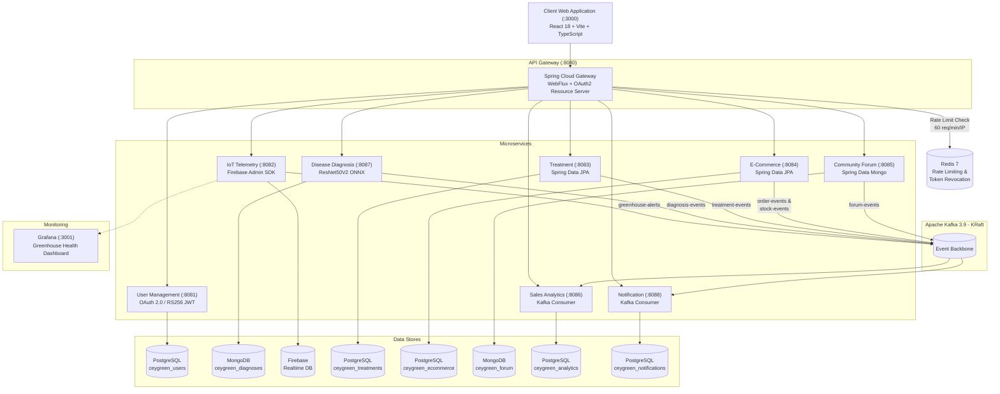

# CeyGreen — Cloud-Native Greenhouse Management Ecosystem

**CeyGreen** is an end-to-end, distributed microservices platform engineered to revolutionize precision greenhouse agriculture. It combines real-time IoT environmental telemetry, machine-learning-powered plant disease diagnostics, automated treatment advisors, an e-commerce agricultural marketplace, a community agronomist forum, and centralized sales analytics & notification engines into a resilient, scalable ecosystem.

---

## Live Azure Deployment & Infrastructure

- **Live Web Application**: **[http://172.198.138.134:3000](http://172.198.138.134:3000)** (Hosted on Azure VM `Standard_B2s`, India South Central, Ubuntu 24.04 LTS).
- **Reverse Proxy**: Nginx SPA reverse proxy routing `/api/**` traffic internally to `api-gateway:8080`.
- **Automated CI/CD**: GitHub Actions workflows (`.github/workflows/cd.yml` for GHCR publish, `.github/workflows/cd-azure.yml` for Azure VM deployment) compile, test, build Docker container images, and deploy directly to the live Azure VM instance on branch merges.

---

## System Architecture


```mermaid
graph TD
    Client["Client Web Application (:3000)<br/>React 18 + Vite + TypeScript"] --> GW

    subgraph API["API Gateway (:8080)"]
        GW["Spring Cloud Gateway<br/>WebFlux + OAuth2 Resource Server"]
    end

    GW -->|"Rate Limit Check<br/>60 req/min/IP"| Redis[("Redis 7<br/>Rate Limiting &<br/>Token Revocation")]

    GW --> S2_User
    GW --> S2_Diag
    GW --> S1
    GW --> S3
    GW --> S4
    GW --> S5
    GW --> S6_Analytics
    GW --> S6_Notify

    subgraph Services["Microservices"]
        S2_User["User Management (:8081)<br/>OAuth 2.0 / RS256 JWT"]
        S2_Diag["Disease Diagnosis (:8087)<br/>ResNet50V2 ONNX"]
        S1["IoT Telemetry (:8082)<br/>Firebase Admin SDK"]
        S3["Treatment (:8083)<br/>Spring Data JPA"]
        S4["E-Commerce (:8084)<br/>Spring Data JPA"]
        S5["Community Forum (:8085)<br/>Spring Data Mongo"]
        S6_Analytics["Sales Analytics (:8086)<br/>Kafka Consumer"]
        S6_Notify["Notification (:8088)<br/>Kafka Consumer"]
    end

    subgraph Databases["Data Stores"]
        DB_User[("PostgreSQL<br/>ceygreen_users")]
        DB_Diag[("MongoDB<br/>ceygreen_diagnoses")]
        DB1[("Firebase<br/>Realtime DB")]
        DB3[("PostgreSQL<br/>ceygreen_treatments")]
        DB4[("PostgreSQL<br/>ceygreen_ecommerce")]
        DB5[("MongoDB<br/>ceygreen_forum")]
        DB6[("PostgreSQL<br/>ceygreen_analytics")]
        DB7[("PostgreSQL<br/>ceygreen_notifications")]
    end

    S2_User --> DB_User
    S2_Diag --> DB_Diag
    S1 --> DB1
    S3 --> DB3
    S4 --> DB4
    S5 --> DB5
    S6_Analytics --> DB6
    S6_Notify --> DB7

    subgraph EventBus["Apache Kafka 3.9 - KRaft"]
        Kafka[("Event Backbone")]
    end

    S1 -->|"greenhouse-alerts"| Kafka
    S2_Diag -->|"diagnosis-events"| Kafka
    S3 -->|"treatment-events"| Kafka
    S4 -->|"order-events &<br/>stock-events"| Kafka
    S5 -->|"forum-events"| Kafka
    Kafka --> S6_Analytics
    Kafka --> S6_Notify

    subgraph Monitoring["Monitoring"]
        Grafana["Grafana (:3001)<br/>Greenhouse Health Dashboard"]
    end

    S1 -.-> Grafana
```

---

## Microservices Breakdown

| Service | Port | Primary Datastore | Key Technologies | Description |
|---|---|---|---|---|
| **API Gateway** | `8080` | Redis 7 | Spring Cloud Gateway, WebFlux, OAuth2 Resource Server | Central entry point, path routing, rate limiting, and CORS handling. |
| **User Service** | `8081` | PostgreSQL (`ceygreen_users`) | Spring Boot 3, JPA, BCrypt, RSA JWT Issuer | User registration, login, profile management, and RS256 token minting. |
| **Disease Diagnosis Service** | `8087` | MongoDB (`ceygreen_diagnoses`) | Spring Boot 3, ONNX Runtime, TwelveMonkeys ImageIO | In-process ResNet50V2 ML disease classification, scan history, image storage. |
| **IoT Telemetry Service** | `8082` | Firebase Realtime DB | Spring Boot 3, Firebase Admin SDK, Kafka Producer | Greenhouse sensor telemetry (temperature, humidity, NPK) and actuator controls. |
| **Treatment Service** | `8083` | PostgreSQL (`ceygreen_treatments`) | Spring Boot 3, Spring Data JPA, Kafka Producer | Crop disease treatments, chemical/organic remedies, dosage, and safety info. |
| **E-Commerce Service** | `8084` | PostgreSQL (`ceygreen_ecommerce`) | Spring Boot 3, Spring Data JPA, Kafka Producer | Marketplace products catalog, inventory control, and shopping cart/orders. |
| **Community Forum Service** | `8085` | MongoDB (`ceygreen_forum`) | Spring Boot 3, Spring Data Mongo, Gemini AI | Farmer discussion boards, agronomist consultation, and QA threads. |
| **Sales Analytics Service** | `8086` | PostgreSQL (`ceygreen_analytics`) | Spring Boot 3, JPA, Kafka Consumer | Aggregates revenue, order volume, crop trends, and business intelligence. |
| **Notification Service** | `8088` | PostgreSQL (`ceygreen_notifications`) | Spring Boot 3, JPA, Kafka Consumer | Multi-channel alert dispatch for sensor warnings, disease scans, and orders. |
| **Frontend Web App** | `3000` | Nginx SPA | React 18, Vite, TypeScript, TailwindCSS | Responsive web UI with interactive diagnosis scanner, charts, and marketplace. |

---

## Core Service Deep Dives

### 1. User Management Service (`user-service` — Port 8081)
The **User Service** serves as the central identity authority for the entire ecosystem.

- **Asymmetric RS256 JWT Token Issuer**: Mints tokens using a 2048-bit RSA Private Key (`dev-private.pem`). The gateway and downstream services validate tokens locally using the matching Public Key (`dev-public.pem`) without inter-service latency.
- **Timing-Attack Resistant Authentication**: Implements BCrypt password hashing with decoy hash matching for unknown emails to guarantee uniform execution time and prevent account enumeration.
- **Role-Based Access Control (RBAC)**: Enforces self-registration rules and permission boundaries for `FARMER`, `BUYER`, and `ADMIN` roles.
- **Defense-in-Depth Internal Security**: Enforces `X-API-Key` verification via `ApiKeyAuthFilter` so direct, unauthorized bypass requests to the container are blocked.

#### Key Endpoints:
```http
POST /api/users/register     - Register a new Farmer or Buyer account
POST /api/users/login        - Authenticate credentials and receive RS256 Bearer Token
GET  /api/users/{id}         - Retrieve user profile (requires Bearer Token & X-API-Key)
PUT  /api/users/{id}         - Update profile information (requires Bearer Token & X-API-Key)
GET  /.well-known/jwks.json  - Public JWKS endpoint for token validation
```

---

### 2. Disease Diagnosis Service (`diagnosis-service` — Port 8087)
The **Disease Diagnosis Service** delivers real-time, deep-learning-based plant leaf pathology identification.

- **In-Process ONNX Runtime Inference**: Employs Microsoft ONNX Runtime (`ai.onnxruntime`) executing a pre-trained **ResNet50V2 Transfer Learning Model** (`disease_model.onnx`, 94.3 MB) directly inside the JVM using native C++ bindings for zero-latency execution.
- **25 Plant Pathology Classes**: Classifies conditions across Tomato, Potato, Pepper, Grape, and Strawberry crops (e.g., *Early Blight, Late Blight, Bacterial Spot, Leaf Mold, Mosaic Virus*).
- **Native Image Decoding**: Integrated **TwelveMonkeys ImageIO** (`imageio-webp:3.12.0`) enabling seamless processing of `.webp`, `.png`, `.jpg`, and `.jpeg` leaf uploads.
- **Image Preprocessing**: Resizes uploads to `224×224` via bilinear interpolation and formats pixels into raw `[1, 224, 224, 3]` NHWC float tensors with built-in graph normalization.
- **Safety Confidence Thresholding**: Automatically returns `uncertain - consult an expert` for predictions with confidence scores `< 0.60 (60%)`, preventing false-positive treatment applications.
- **SHA-256 Image Caching**: Computes checksums on incoming image bytes to return instantaneous cached results for repeated uploads, reducing GPU/CPU workload.
- **Asynchronous Kafka Event Producer**: Emits messages to topic `diagnosis-events` asynchronously via `CompletableFuture`, ensuring broker downtime never blocks or fails farmer diagnosis uploads.
- **Google Gemini 1.5 Flash AI Integration**: Powers frontend clinical recovery plans, dynamically generating 14-day agronomic recovery schedules, greenhouse climate adjustments, and foliar spray programs.

#### Key Endpoints:
```http
POST   /api/diagnosis/upload                - Upload leaf image (multipart/form-data) & run ONNX inference
GET    /api/diagnosis/{id}                  - Fetch single diagnosis record
GET    /api/diagnosis/history/{farmerId}    - List farmer's past diagnoses
GET    /api/diagnosis/history/{farmerId}/paged - Paginated history list
DELETE /api/diagnosis/{id}                  - Delete diagnosis record & associated image file
GET    /api/diagnosis/images/{filename}     - Serve diagnostic image
```

---

## Asynchronous Event Backbone (Apache Kafka)

| Topic | Producer | Consumer(s) | Trigger / Purpose |
|---|---|---|---|
| `diagnosis-events` | `diagnosis-service` | `notification-service`, `analytics-service` | Fired on successful leaf disease scan. |
| `greenhouse-alerts` | `iot-service` | `notification-service` | Fired when sensor thresholds (temp, humidity, NPK) enter critical state. |
| `treatment-events` | `treatment-service` | `notification-service` | Fired when high-urgency chemical treatments are recommended. |
| `order-events` | `ecommerce-service` | `analytics-service`, `notification-service` | Fired upon successful customer marketplace checkout. |
| `stock-events` | `ecommerce-service` | `notification-service` | Fired when product stock drops below critical threshold. |
| `forum-events` | `forum-service` | `notification-service` | Fired on expert agronomist replies and discussion topics. |

---

## Security Architecture & Principles

1. **Defense-in-Depth Gateway & Filter Protection**:
   - The central API Gateway checks JWT claims, rate limits by client IP, and injects verified identity headers (`X-Farmer-Id`, `X-User-Role`, `X-API-Key`).
   - Every individual backend service runs an internal `ApiKeyAuthFilter` to reject any requests bypassing the gateway.
2. **Stateless JWT Verification**:
   - Microservices validate RS256 token signatures locally via the shared public key without calling the User Service on each request.
3. **Database-Per-Service Isolation**:
   - Microservices maintain isolated databases/schemas with no cross-service database access.
4. **Client-Orchestrated Coordination**:
   - When a diagnosis identifies a disease, the frontend client independently queries the Treatment Service (`GET /treatments/{diseaseName}`) to retrieve matching cures.

---

## Local Development & Setup

### Prerequisites
- **Docker Desktop** (v24+ / Docker Compose v2+)
- **Java 17+** & **Maven 3.9+** (for manual local builds)
- **Node.js 20+** & **npm** (for frontend development)

### 1. Clone the Repository
```bash
git clone https://github.com/vikumkodikara/CeyGreen.git
cd CeyGreen
```

### 2. Environment Configuration
Create a `.env` file in the project root:
```bash
cp .env.example .env
```
Key configuration settings in `.env`:
```env
SERVICE_API_KEY=ceygreen-dev-api-key
CORS_ALLOWED_ORIGINS=http://localhost:3000,http://localhost:5173,http://172.198.138.134:3000,*
RATE_LIMIT_REQUESTS_PER_MIN=60
VITE_API_BASE_URL=/api
GEMINI_API_KEY=your_gemini_api_key_here
```

### 3. Launch Full Application Stack via Docker Compose
```bash
docker compose up -d --build
```

### 4. Verify Services Status
```bash
docker compose ps
```

---

## Service URL Directory

| Resource / Service | Local URL | Live Azure Production URL |
|---|---|---|
| **React Web Client** | `http://localhost:3000` | **`http://172.198.138.134:3000`** |
| **API Gateway Health** | `http://localhost:8080/actuator/health` | `http://172.198.138.134:8080/actuator/health` |
| **User Service Health** | `http://localhost:8081/actuator/health` | `http://172.198.138.134:8081/actuator/health` |
| **Diagnosis Service Health** | `http://localhost:8087/actuator/health` | `http://172.198.138.134:8087/actuator/health` |
| **IoT Service Health** | `http://localhost:8082/actuator/health` | `http://172.198.138.134:8082/actuator/health` |
| **Treatment Service Health** | `http://localhost:8083/actuator/health` | `http://172.198.138.134:8083/actuator/health` |
| **E-Commerce Service Health** | `http://localhost:8084/actuator/health` | `http://172.198.138.134:8084/actuator/health` |
| **Forum Service Health** | `http://localhost:8085/actuator/health` | `http://172.198.138.134:8085/actuator/health` |
| **Sales Analytics Service Health** | `http://localhost:8086/actuator/health` | `http://172.198.138.134:8086/actuator/health` |
| **Notification Service Health** | `http://localhost:8088/actuator/health` | `http://172.198.138.134:8088/actuator/health` |

---

## Author & Contribution

Developed as part of the **CeyGreen Smart Greenhouse Management System**.  
Core ownership: **User Management & Authentication Service (`user-service`)** and **AI Plant Disease Diagnosis Service (`diagnosis-service`)**, including ResNet50V2 ONNX Runtime inference, MongoDB storage, and Kafka event streaming.
